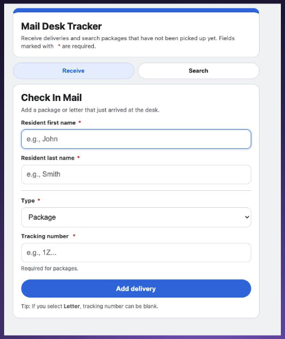
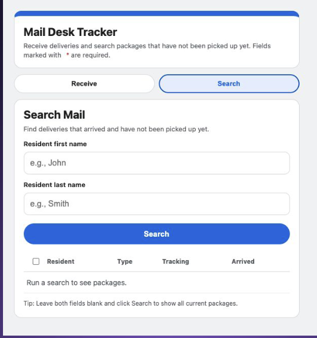
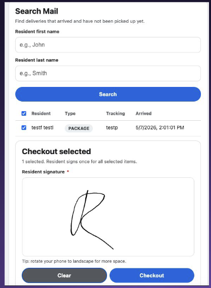

# Package Desk Tracker

Mobile-friendly package desk management system built with Google Apps Script and Google Sheets.

## Features

- Check in packages and letters
- Search unclaimed mail
- Checkout workflow with resident signatures
- Vector-based SVG signature storage
- Google Groups access control
- Mobile-friendly UI
- Automatic spreadsheet syncing

---

## Screenshots

### Check In Mail


### Search Mail


### Signature Checkout


---

## Tech Stack

- Google Apps Script
- Google Sheets
- HTML/CSS/JavaScript
- SignaturePad.js
- SVG vector rendering

---

## Setup Guide

A full visual setup walkthrough is included here:

[Package Setup Instructions](./Package%20Setup.pdf)

The guide covers:

1. Google Groups setup
2. Spreadsheet setup
3. Apps Script deployment
4. Authorization setup
5. Signature viewing
6. QR code deployment

---

## Required Spreadsheet Columns

Your `Deliveries` sheet must contain:

| Column |
|---|
| id |
| first_name |
| last_name |
| type |
| tracking_number |
| arrived_at |
| checked_in_by |
| picked_up_at |
| checked_out_by |
| signature_url |
| signed_at |

---

in first row.

## Installation

### Clone Apps Script Project

```bash
clasp clone 13t2V5wZ4DYgBmLSLERM_CpHaCa3zuYiRZ2XA89W_7Q96wr9QKvkTao_w
```

### Push Changes

```bash
clasp push
```

---

## Security

Access is restricted through Google Groups:

```js
const ACCESS_GROUP = 'your_google_group@domain.com';
```

Only authorized users may access the application.

---

## Signature System

Resident signatures are stored as SVG vector data instead of PNG images.

Advantages:
- Smaller storage size
- Faster rendering
- No Drive uploads
- Infinite scaling
- Easier spreadsheet integration

---

## Deployment

1. Open Apps Script
2. Deploy → New Deployment
3. Select Web App
4. Grant permissions
5. Share deployment URL

Detailed screenshots are available in the setup PDF.

---

## Author

Ryan Aparicio

GitHub:
https://github.com/YOUR_USERNAME